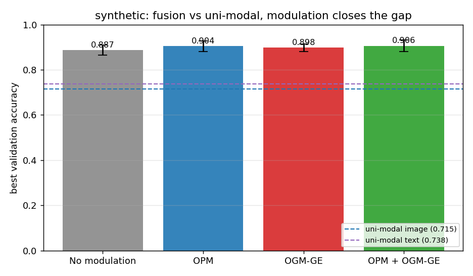
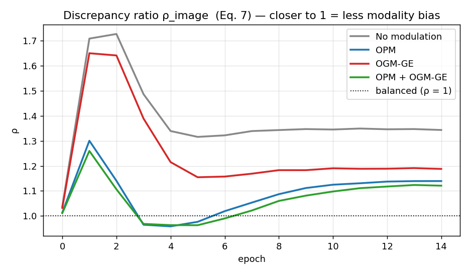
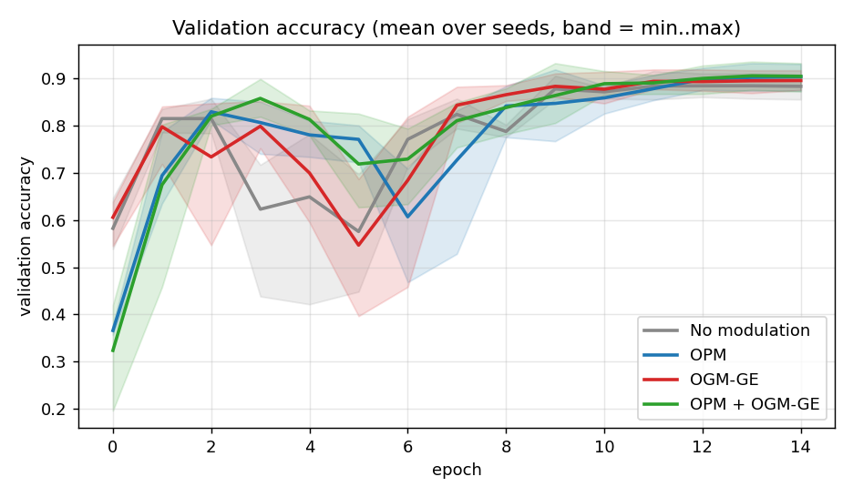
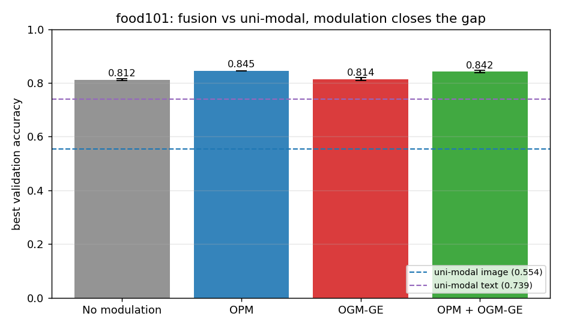
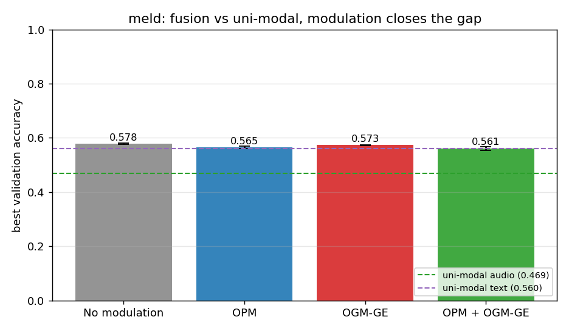

# XAI-Driven Modality Bias Detection and Mitigation in Multimodal Deep Learning Models

Deep Learning semester project — see [`Project_Proposal.md`](Project_Proposal.md) for the full proposal
(PaliGemma-3B bias detection with attention analysis / Integrated Gradients, Balanced Modal Attention, bias regularization).

**Detect → quantify → mitigate → verify:** XAI (attention / Integrated Gradients) se pata chalta hai *kahan* bias hai,
discrepancy ratio ρ se *kitna*, aur training-time modulation (OPM / OGM-GE) se *fix* hota hai.

## Project resources

**Train from a fresh clone:** [Open the configurable Colab notebook](https://colab.research.google.com/github/Nishant21092004/DL_project/blob/main/balanced_mm/notebooks/02_colab_training.ipynb). It includes a real-data sample in the repository, custom/full-data download options, fresh training, held-out test metrics, graphs, and confusion matrices. See [the Colab guide](balanced_mm/COLAB_GUIDE.md) and [new sample-run results](balanced_mm/demo_runs/RESULTS.md). These short demo runs are separate from the older benchmark below.

| Resource | File |
|---|---|
| Review questions and answers | [`docs/REVIEW_QA.md`](docs/REVIEW_QA.md) |
| Implementation guide | [`balanced_mm/README.md`](balanced_mm/README.md) |
| Example workflow and saved outputs | [`balanced_mm/notebooks/01_walkthrough.ipynb`](balanced_mm/notebooks/01_walkthrough.ipynb) |
| Experiment results and plots | [`balanced_mm/results/RESULTS.md`](balanced_mm/results/RESULTS.md) |
| OPM / OGM-GE implementation | [`balanced_mm/bml/modulation.py`](balanced_mm/bml/modulation.py) |
| PaliGemma attention heat-map demo | [`multimodal (2).ipynb`](multimodal%20(2).ipynb) |
| Unit tests | [`balanced_mm/tests/`](balanced_mm/tests/) |

## Repository layout

| Path | What it is |
|---|---|
| `Project_Proposal.md` | One-page project proposal |
| `multimodal (2).ipynb` | Colab notebook: PaliGemma-3B loading, prompt/VQA demo, attention heat-map (XAI) |
| **`balanced_mm/`** | **Training-time modality-bias mitigation baseline: OPM / OGM-GE** (Wei et al., TPAMI 2024) — full PyTorch implementation for Text + Image late-fusion models, with tests, synthetic benchmark, auto-report and plug-in module. See [`balanced_mm/README.md`](balanced_mm/README.md). |
| `docs/REVIEW_QA.md` | Review prep — likely questions + crisp answers (Hinglish) |
| `docs/OGM_OPM_Explanation.pdf` | Hinglish notes: derivations (cross-entropy gradient, GD/SGD), why one modality dominates, OPM/OGM/GE equations, all techniques compared |
| `docs/Wei2024_On-the-fly_Modulation_TPAMI.pdf` | The reference paper (arXiv:2410.11582) |

Inside `balanced_mm/`:

| Path | What it is |
|---|---|
| `bml/modulation.py` | ★ core: ρ (Eq 6/7), OPM (Eq 8), OGM-GE (Eq 11/12/16/17) — standalone module |
| `bml/xai.py` | **Detection side:** Integrated Gradients, grad×input token scores, modality attribution shares |
| `bml/metrics.py` | Confusion matrix, per-class accuracy, macro-F1, calibration error |
| `bml/models.py` / `bml/data.py` / `bml/engine.py` | Encoders + late fusion (incl. VectorMLPEncoder for audio features), CSV + synthetic data (image/audio/text columns auto-detected), train/eval loops (Alg 1/2) |
| `bml/analysis.py` + `scripts/make_report.py` | runs → `results/` auto-report (tables + plots) |
| `train.py` / `eval.py` / `compare.py` | CLI training (`--modulation none\|opm\|ogm\|both`), checkpoint eval (confusion/ECE), multi-run tables |
| `scripts/run_food101.sh` / `run_meld.sh` | Real datasets: Food-101 (image + prompt-text), MELD (text + audio) — full comparison scripts |
| `notebooks/01_walkthrough.ipynb` | **Executed** demo — code + output in GitHub Preview |
| `tests/` | 27 unit tests (equations, models, xai, metrics, analysis) |
| `results/`, `runs/` | Generated report + raw run logs/histories |

## Modality-bias mitigation baseline (`balanced_mm/`)

The proposal's *Modality Bias Score* measures **where the model looks** (attention mass on image vs. text tokens).
`balanced_mm/` adds the complementary **optimisation-side** view from the TPAMI-2024 paper: in joint training the
logits are a sum of uni-modal contributions `f = W¹φ¹ + W²φ² + b`, so the more discriminative modality drives
`∂ℓ/∂f = softmax(f) − onehot(y) → 0` and the other encoder is left under-optimised.
The module monitors a per-batch **discrepancy ratio ρᵐ** (Eq. 6–7) and

* **OPM** – drops the dominant modality's feature with adaptive probability `q = q_base(1 + λ·tanh(ρ−1))` (forward pass),
* **OGM-GE** – scales the dominant encoder's gradient by `k = 1 − α·tanh(ρ−1)` and re-injects Gaussian noise so the
  SGD-noise variance becomes `(k²+1)×` the original (backward pass).

```bash
cd balanced_mm
pip install -r requirements.txt
python -m pytest tests/                                             # 27 tests
bash scripts/run_synthetic_compare.sh 15 2400 smallcnn 3           # uni-modal + none/opm/ogm/both
bash scripts/run_seed_sweep.sh                                      # + seeds 1,2 (reproducibility)
python scripts/make_report.py                                       # -> results/RESULTS.md + plots
python train.py --data csv --train_csv data/train.csv --val_csv data/val.csv --img_root data/images \
                --modulation ogm --probe                            # your own Text+Image data
python plug_in_example.py                                           # add OPM/OGM to an existing loop in 3 lines
```

## Results (synthetic benchmark — mean ± std over 3 seeds)

Protocol: 2400 train / 600 val, 6 classes, informative w.p. 0.7 per modality, SmallCNN + Transformer text,
late fusion, SGD lr 0.01, 15 epochs. Full auto-report: [`balanced_mm/results/RESULTS.md`](balanced_mm/results/RESULTS.md).

| modulation | best val acc | last-3-epoch avg | ρ_image (final) |
|---|---|---|---|
| uni-modal image only | 0.715 | – | – |
| uni-modal text only | 0.738 | – | – |
| fusion, **none** | 0.887 ± 0.022 | 0.884 | 1.344 |
| fusion, **OGM-GE** | 0.898 ± 0.017 | 0.894 | 1.188 |
| fusion, **OPM** | 0.904 ± 0.023 | 0.901 | 1.140 |
| fusion, **OPM + OGM-GE** | **0.906 ± 0.025** | 0.903 | **1.121** |

Fusion ≫ uni-modal (+15 pts) → dono modalities actually use ho rahi hain; modulation se bias (ρ 1.34 → 1.12)
kam hota hai **aur** accuracy upar jaati hai. Severe stress test (`--syn_synonyms 6`): baseline ρ ≈ 4.8 → OPM ≈ 2.3.







Single-run full curves (train loss / ρ / k / q): [`balanced_mm/runs/curves.png`](balanced_mm/runs/curves.png).

### Real datasets — Food-101 & MELD (3 seeds each, scripts: `run_food101.sh` / `run_meld.sh`)

**Food-101** — 10 classes, image + CLIP-style prompt text (2,500 train / 1,000 val, 12 epochs):

| | best val acc | ρ_text |
|---|---|---|
| uni image / uni text | 0.554 / 0.739 | – |
| fusion none | 0.812 ± 0.004 | 2.73 |
| fusion OGM-GE | 0.814 ± 0.005 | 2.69 |
| fusion **OPM** | **0.845 ± 0.000** | **2.09** |
| fusion both | 0.842 ± 0.005 | 2.01 |

Text dominant (prompt me class name) → OPM ne balance kiya (ρ_text 2.73→2.09) **aur**
acc **+3.3 pts** diye (0.812→0.845). Images repo ki size ke liye 96px me save hain —
full-res pe yehi protocol ~1.4 pts better tha (none 0.826, OPM 0.857); ranking same.



**MELD** — 7 emotions, text + official 300-d audio embeddings (9,989 train / 1,109 val):

| | best val acc | ρ_text / ρ_audio |
|---|---|---|
| uni text / uni audio | 0.560 / 0.469 | – |
| fusion none | **0.578 ± 0.002** | 2.22 / 0.46 |
| fusion OGM-GE | 0.573 ± 0.002 | 1.60 / 0.63 |
| fusion OPM | 0.565 ± 0.004 | 1.24 / 0.82 |
| fusion both | 0.561 ± 0.006 | 1.22 / 0.83 |

Balance yahan **sabse strong** (ρ_text 2.22→1.22) lekin acc thoda neeche — MELD me text hi
asli signal hai (uni text ≈ fused), audio weak; honest trade-off ka jawab review ke liye
[`docs/REVIEW_QA.md`](docs/REVIEW_QA.md) me ready hai.



## Team
I24AI001, I24AI009, I24AI026, I24AI028
