# Reproducible training demo

Executed at 2026-10-08T10:19:48.251688+00:00

New models on the selected data; separate from the older three-seed benchmark in results/RESULTS.md.

Epochs: 5; text dimension/layers: 64/1; image encoder: smallcnn.

Best checkpoint selected using validation accuracy; test evaluated after training.

| Dataset | Method | Seed | Best val accuracy | Test accuracy | Test macro-F1 |
|---|---|---|---|---|---|
| food101 | none | 0 | 0.4000 | 0.3000 | 0.2841 |
| food101 | opm | 0 | 0.4000 | 0.4400 | 0.4371 |
| food101 | ogm | 0 | 0.4600 | 0.4000 | 0.3778 |
| food101 | both | 0 | 0.3600 | 0.2800 | 0.2595 |
| meld | none | 0 | 0.2857 | 0.3429 | 0.3132 |
| meld | opm | 0 | 0.3571 | 0.2429 | 0.2241 |
| meld | ogm | 0 | 0.3286 | 0.2857 | 0.2284 |
| meld | both | 0 | 0.2571 | 0.2714 | 0.2170 |

## Data and scope

- **food101**: train=200, val=50, test=50. Validation reserved from original training images; original test images used only for test.
- **meld**: train=350, val=70, test=70. Official train, development, and test splits preserved.

Food-101 text is generated from labels: a controlled shortcut/bias experiment, not a natural image-and-caption benchmark.
MELD uses real text and official 300-dimensional audio features. Positive per-class limits create a balanced demo sample; zero retains the full official distribution.
Small samples, one seed, and short training verify the pipeline, not a publishable improvement.

## Saved evidence

### food101_s0_none

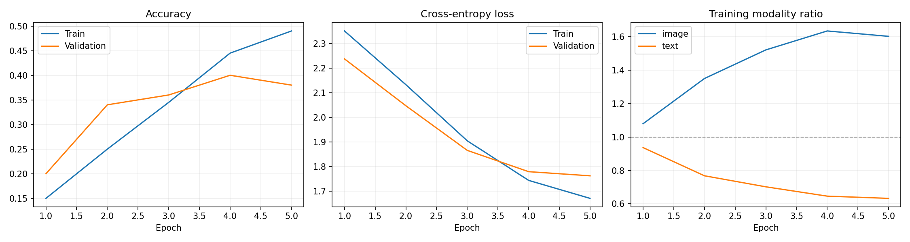

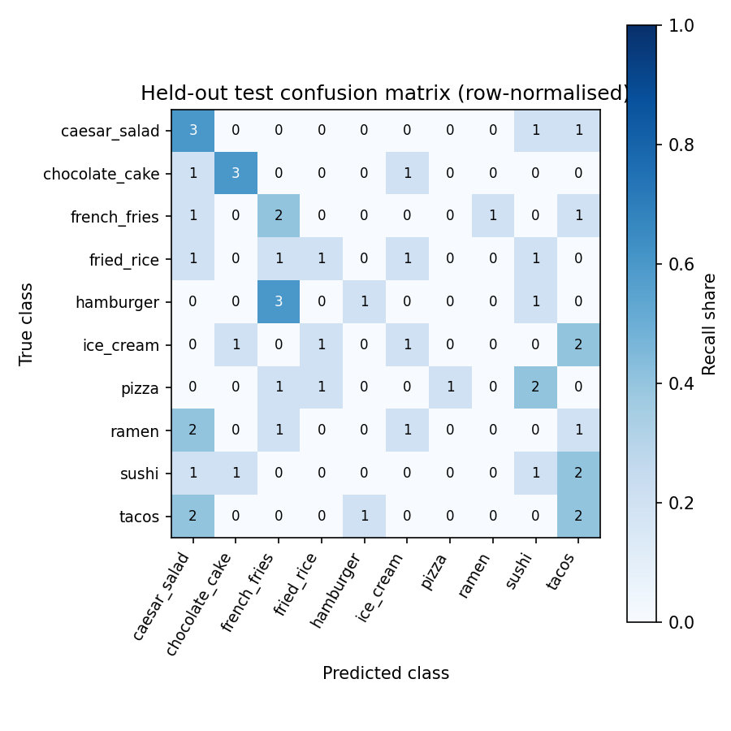

[Training log](food101_s0_none/train.log) · [History](food101_s0_none/history.json) · [Test metrics](food101_s0_none/eval_test.csv.json)

### food101_s0_opm

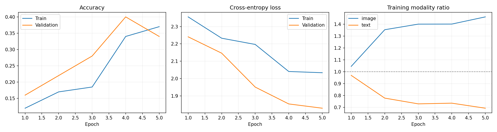

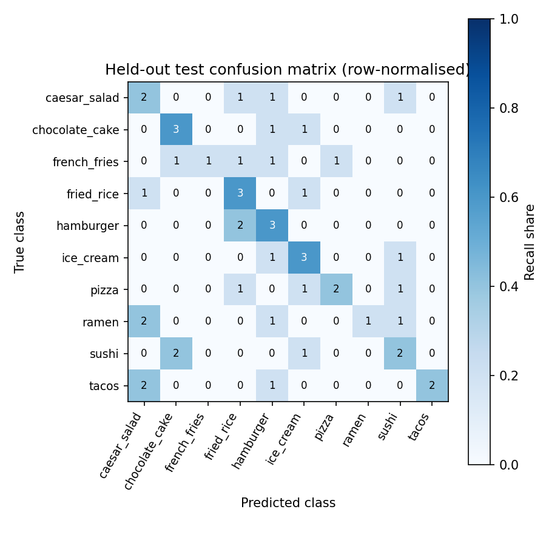

[Training log](food101_s0_opm/train.log) · [History](food101_s0_opm/history.json) · [Test metrics](food101_s0_opm/eval_test.csv.json)

### food101_s0_ogm

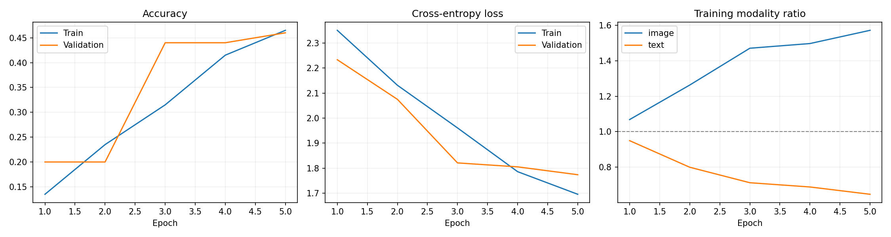

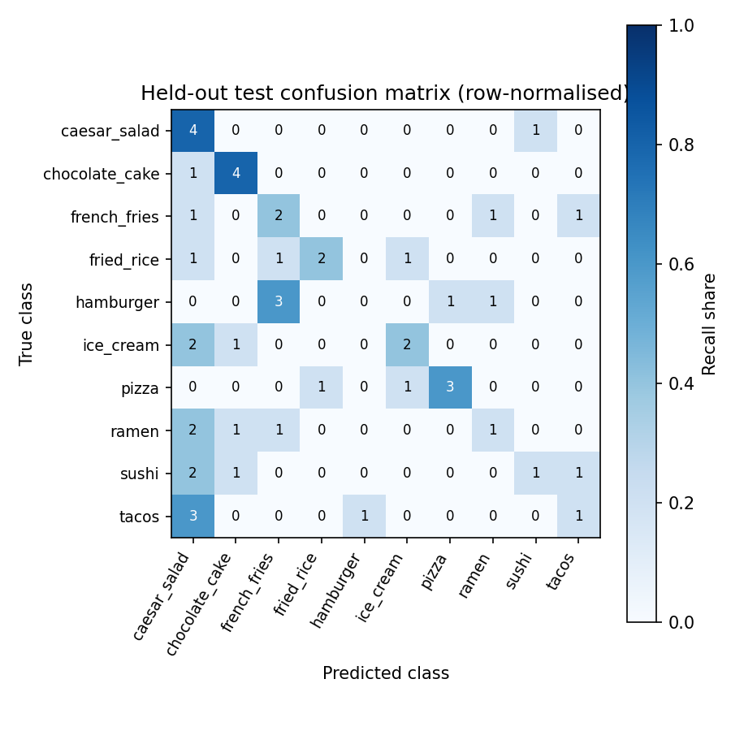

[Training log](food101_s0_ogm/train.log) · [History](food101_s0_ogm/history.json) · [Test metrics](food101_s0_ogm/eval_test.csv.json)

### food101_s0_both

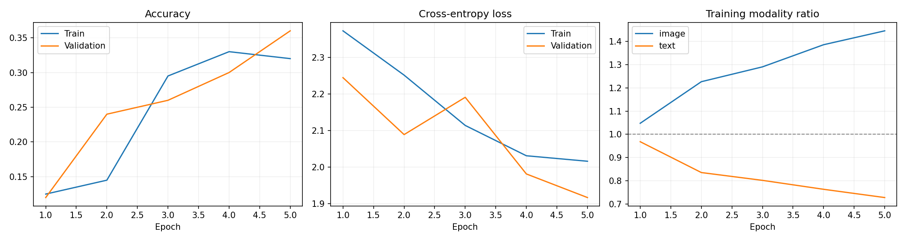

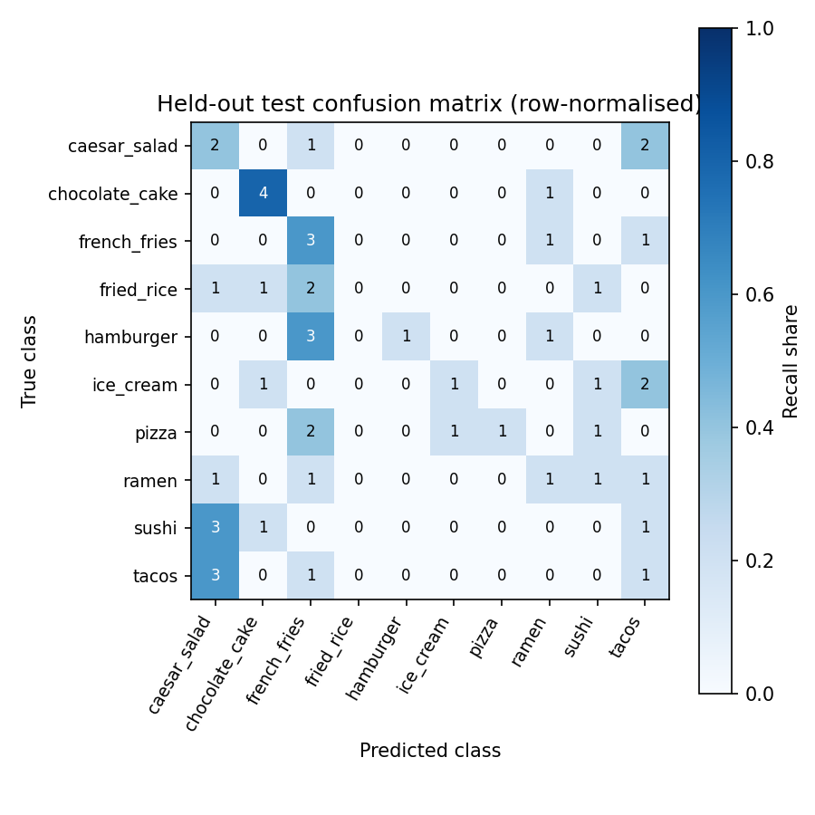

[Training log](food101_s0_both/train.log) · [History](food101_s0_both/history.json) · [Test metrics](food101_s0_both/eval_test.csv.json)

### meld_s0_none

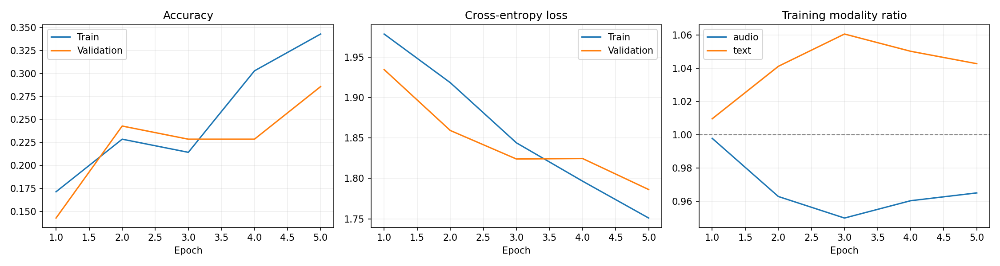

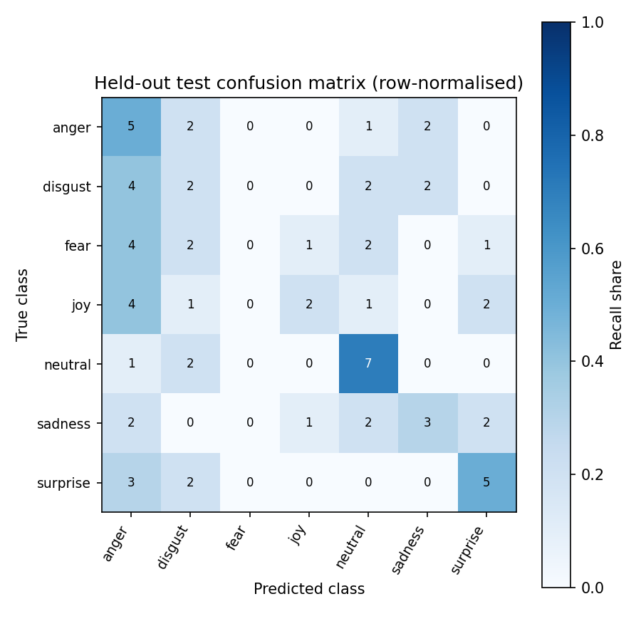

[Training log](meld_s0_none/train.log) · [History](meld_s0_none/history.json) · [Test metrics](meld_s0_none/eval_test.csv.json)

### meld_s0_opm

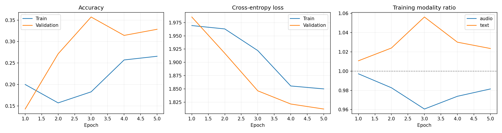

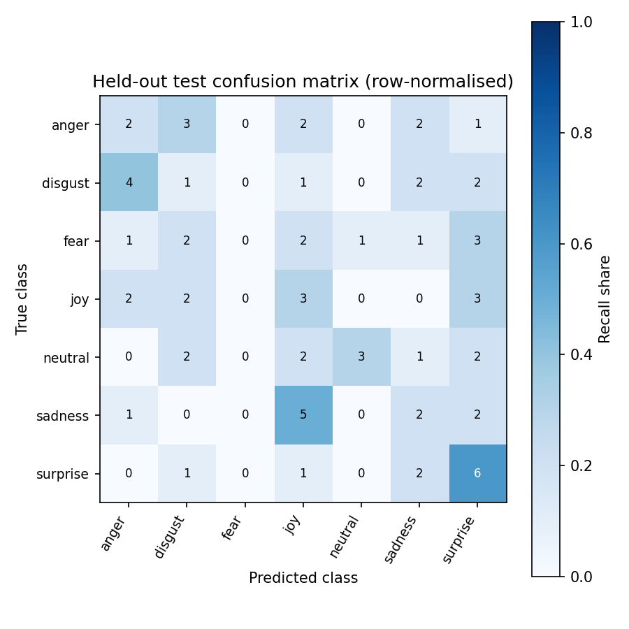

[Training log](meld_s0_opm/train.log) · [History](meld_s0_opm/history.json) · [Test metrics](meld_s0_opm/eval_test.csv.json)

### meld_s0_ogm

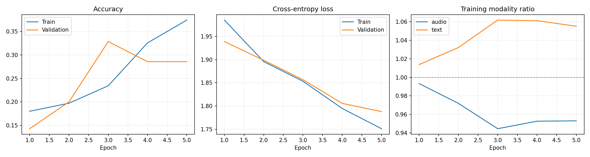

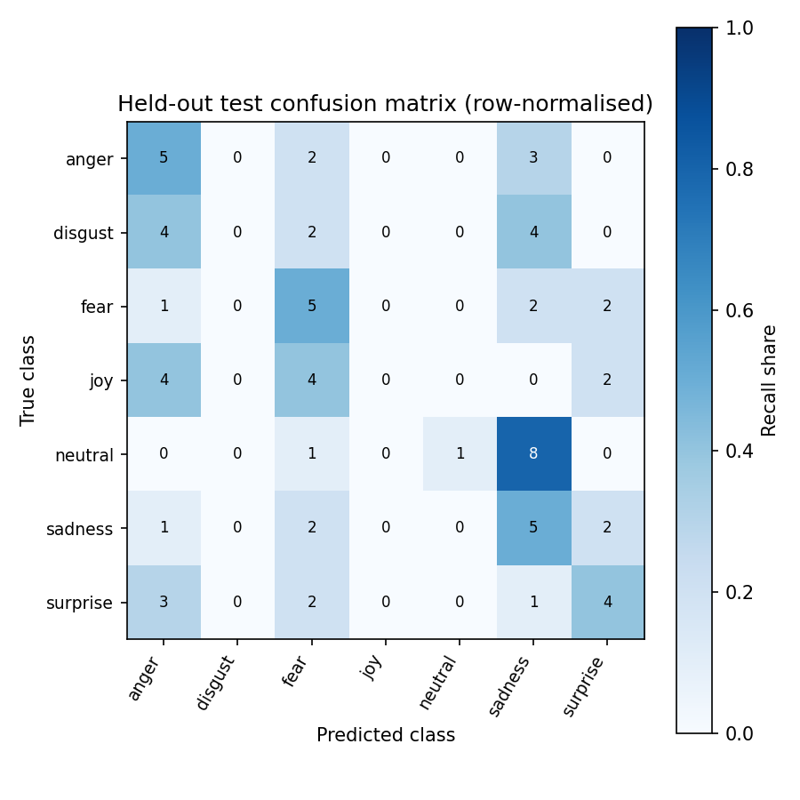

[Training log](meld_s0_ogm/train.log) · [History](meld_s0_ogm/history.json) · [Test metrics](meld_s0_ogm/eval_test.csv.json)

### meld_s0_both

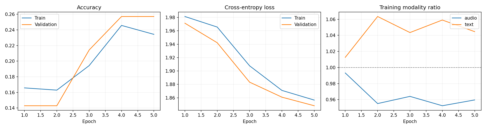

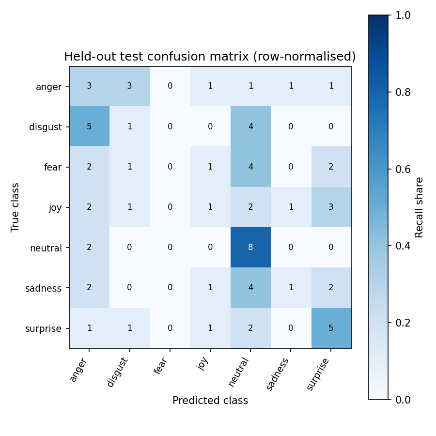

[Training log](meld_s0_both/train.log) · [History](meld_s0_both/history.json) · [Test metrics](meld_s0_both/eval_test.csv.json)
