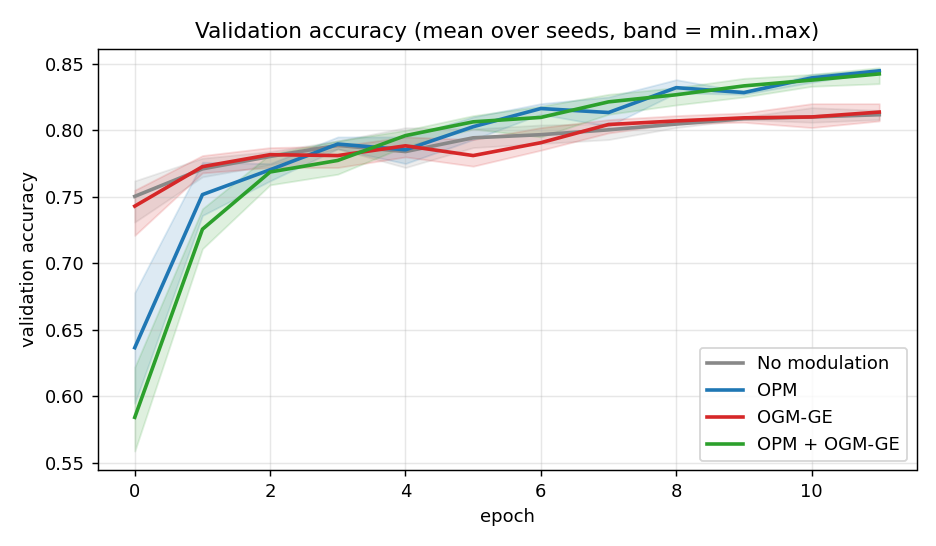
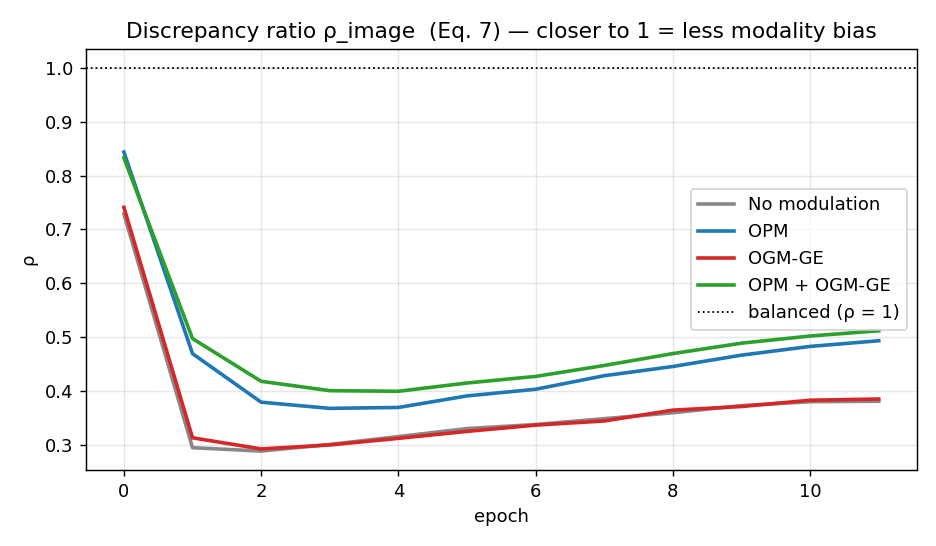
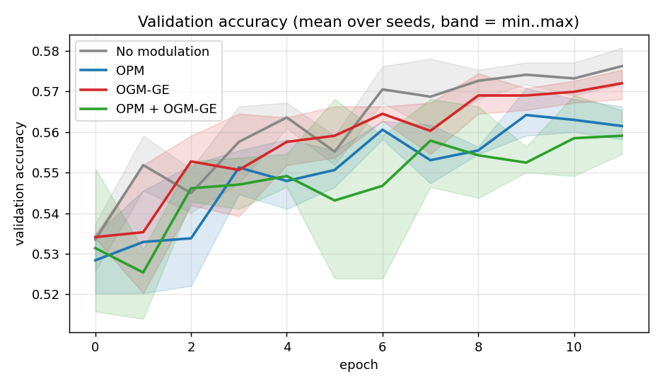
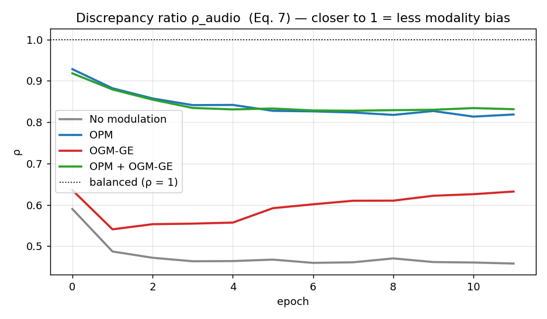

# Benchmark results

_Auto-generated by `python scripts/make_report.py`; do not edit by hand._

## Food-101 (image + prompt-text)

### Protocol

- dataset: food101
- train_csv: data/food101/train.csv
- val_csv: data/food101/val.csv
- lr: 0.01
- optimizer: sgd
- epochs: 12
- batch_size: 32
- image_encoder: smallcnn
- seeds: 3

### Fusion methods — mean ± std over seeds

| modulation | seeds | best val acc | last-3-epoch val acc | ρ_image (final) | ρ_text (final) |
|---|---|---|---|---|---|
| No modulation | [0, 1, 2] | **0.812 ± 0.004** | 0.810 ± 0.003 | 0.381 ± 0.008 | 2.726 ± 0.050 |
| OPM | [0, 1, 2] | **0.845 ± 0.000** | 0.837 ± 0.001 | 0.494 ± 0.008 | 2.085 ± 0.033 |
| OGM-GE | [0, 1, 2] | **0.814 ± 0.005** | 0.811 ± 0.005 | 0.385 ± 0.003 | 2.694 ± 0.014 |
| OPM + OGM-GE | [0, 1, 2] | **0.842 ± 0.005** | 0.838 ± 0.005 | 0.512 ± 0.001 | 2.005 ± 0.009 |

### Uni-modal baselines

| baseline | best val acc | final uni acc |
|---|---|---|
| image-only | **0.554** | 0.554 |
| text-only | **0.739** | 0.737 |

### Per-run detail

| run | seed | modulation | best acc | best epoch |
|---|---|---|---|---|
| `food_s0_none` | 0 | none | 0.817 | 10 |
| `food_s1_none` | 1 | none | 0.808 | 9 |
| `food_s2_none` | 2 | none | 0.812 | 11 |
| `food_s0_opm` | 0 | opm | 0.844 | 11 |
| `food_s1_opm` | 1 | opm | 0.845 | 11 |
| `food_s2_opm` | 2 | opm | 0.845 | 11 |
| `food_s0_ogm` | 0 | ogm | 0.820 | 10 |
| `food_s1_ogm` | 1 | ogm | 0.807 | 11 |
| `food_s2_ogm` | 2 | ogm | 0.814 | 11 |
| `food_s0_both` | 0 | both | 0.835 | 11 |
| `food_s1_both` | 1 | both | 0.847 | 11 |
| `food_s2_both` | 2 | both | 0.845 | 11 |

### Figures

## MELD (text + audio)

### Protocol

- dataset: meld
- train_csv: data/meld/train.csv
- val_csv: data/meld/val.csv
- lr: 0.01
- optimizer: sgd
- epochs: 12
- batch_size: 32
- audio_encoder: mlp
- seeds: 3

### Fusion methods — mean ± std over seeds

| modulation | seeds | best val acc | last-3-epoch val acc | ρ_audio (final) | ρ_text (final) |
|---|---|---|---|---|---|
| No modulation | [0, 1, 2] | **0.578 ± 0.002** | 0.574 ± 0.002 | 0.458 ± 0.013 | 2.219 ± 0.067 |
| OPM | [0, 1, 2] | **0.565 ± 0.004** | 0.563 ± 0.004 | 0.819 ± 0.019 | 1.237 ± 0.029 |
| OGM-GE | [0, 1, 2] | **0.573 ± 0.002** | 0.570 ± 0.002 | 0.632 ± 0.006 | 1.598 ± 0.014 |
| OPM + OGM-GE | [0, 1, 2] | **0.561 ± 0.006** | 0.557 ± 0.005 | 0.832 ± 0.004 | 1.219 ± 0.008 |

### Uni-modal baselines

| baseline | best val acc | final uni acc |
|---|---|---|
| audio-only | **0.469** | 0.454 |
| text-only | **0.560** | 0.559 |

### Per-run detail

| run | seed | modulation | best acc | best epoch |
|---|---|---|---|---|
| `meld_s0_none` | 0 | none | 0.581 | 11 |
| `meld_s1_none` | 1 | none | 0.577 | 9 |
| `meld_s2_none` | 2 | none | 0.576 | 11 |
| `meld_s0_opm` | 0 | opm | 0.571 | 9 |
| `meld_s1_opm` | 1 | opm | 0.563 | 9 |
| `meld_s2_opm` | 2 | opm | 0.563 | 6 |
| `meld_s0_ogm` | 0 | ogm | 0.575 | 11 |
| `meld_s1_ogm` | 1 | ogm | 0.571 | 9 |
| `meld_s2_ogm` | 2 | ogm | 0.573 | 11 |
| `meld_s0_both` | 0 | both | 0.569 | 10 |
| `meld_s1_both` | 1 | both | 0.555 | 11 |
| `meld_s2_both` | 2 | both | 0.559 | 6 |

### Figures

## Synthetic benchmark

### Protocol

- dataset: synthetic
- data: synthetic
- train_n: 2400
- val_n: 600
- classes: 6
- text_p: 0.7
- img_p: 0.7
- image_encoder: smallcnn
- lr: 0.01
- momentum: 0.9
- epochs: 15
- batch_size: 32
- seeds: 3

### Fusion methods — mean ± std over seeds

| modulation | seeds | best val acc | last-3-epoch val acc | ρ_image (final) | ρ_text (final) |
|---|---|---|---|---|---|
| No modulation | [0, 1, 2] | **0.887 ± 0.022** | 0.884 ± 0.021 | 1.344 ± 0.126 | 0.759 ± 0.075 |
| OPM | [0, 1, 2] | **0.904 ± 0.023** | 0.901 ± 0.022 | 1.140 ± 0.003 | 0.886 ± 0.003 |
| OGM-GE | [0, 1, 2] | **0.898 ± 0.017** | 0.894 ± 0.018 | 1.188 ± 0.065 | 0.855 ± 0.050 |
| OPM + OGM-GE | [0, 1, 2] | **0.906 ± 0.025** | 0.903 ± 0.025 | 1.121 ± 0.008 | 0.901 ± 0.006 |

### Uni-modal baselines

| baseline | best val acc | final uni acc |
|---|---|---|
| image-only | **0.715** | 0.715 |
| text-only | **0.738** | 0.733 |

### Per-run detail

| run | seed | modulation | best acc | best epoch |
|---|---|---|---|---|
| `syn_none` | 0 | none | 0.885 | 13 |
| `sweep_s1_none` | 1 | none | 0.915 | 11 |
| `sweep_s2_none` | 2 | none | 0.860 | 12 |
| `syn_opm` | 0 | opm | 0.905 | 14 |
| `sweep_s1_opm` | 1 | opm | 0.932 | 13 |
| `sweep_s2_opm` | 2 | opm | 0.875 | 12 |
| `syn_ogm` | 0 | ogm | 0.898 | 13 |
| `sweep_s1_ogm` | 1 | ogm | 0.918 | 11 |
| `sweep_s2_ogm` | 2 | ogm | 0.877 | 11 |
| `syn_both` | 0 | both | 0.908 | 14 |
| `sweep_s1_both` | 1 | both | 0.935 | 13 |
| `sweep_s2_both` | 2 | both | 0.875 | 13 |

### Figures

Stress test (`--syn_synonyms 6`, severe text imbalance, synthetic): none ρ_image 4.8 → OPM 2.3 (uni_text 0.25 → 0.31) — modulation always reduces the gap, even when the weaker modality is too hard to rescue fully.
